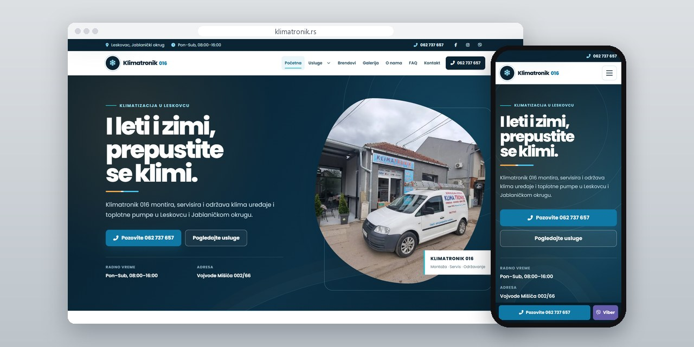
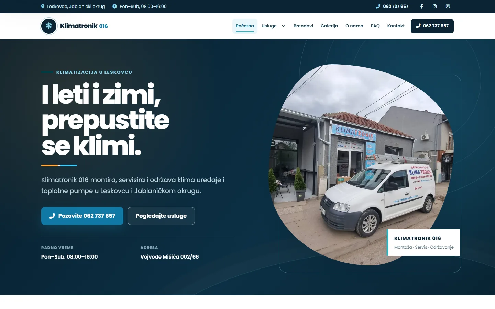
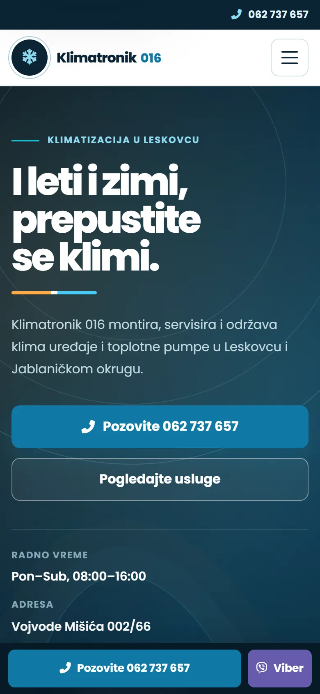
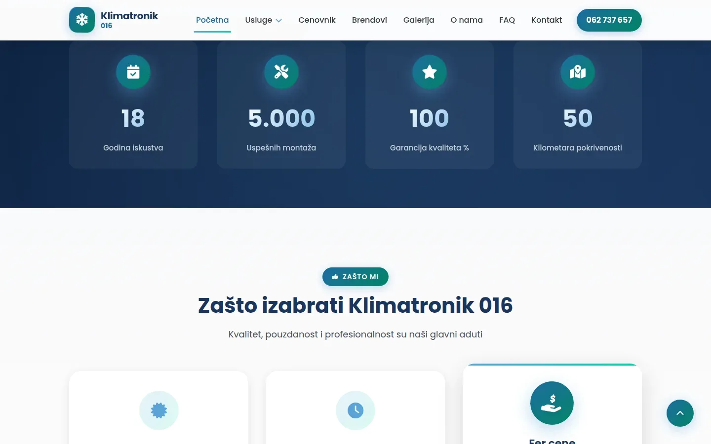
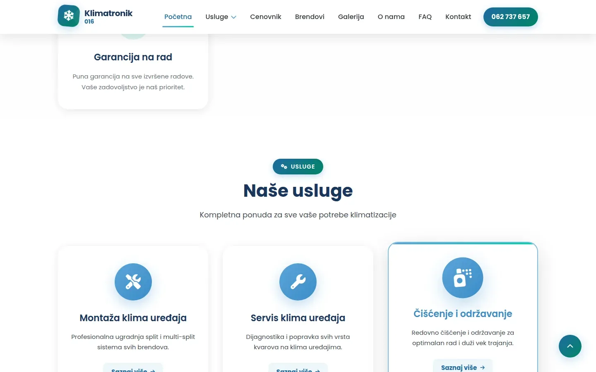

# Klimatronik 016

Site for an air conditioning installer in Leskovac with no contact form: every page leads to a phone call or a Viber message.

**[klimatronik.rs](https://klimatronik.rs/)** · [Case study (in Serbian)](https://svilenkovic.com/radovi/klimatronik-016) · [Srpski](README.sr.md)

> [!NOTE]
> Client project. The source code belongs to the client and stays in a private repository. This page describes what I built and how.

<table>
  <tr><td><b>Client</b></td><td>Klimatronik 016</td></tr>
  <tr><td><b>Industry</b></td><td>Air conditioner and heat pump installation and servicing</td></tr>
  <tr><td><b>Location</b></td><td>Leskovac, Serbia</td></tr>
  <tr><td><b>Type</b></td><td>Multi-page website</td></tr>
  <tr><td><b>My role</b></td><td>Content, SEO, speed and fixes on an existing site, hosting and maintenance</td></tr>
  <tr><td><b>Stack</b></td><td>PHP, nginx, JSON-LD, Consent Mode v2</td></tr>
</table>

## About the project

Klimatronik 016 installs, services and cleans air conditioners and heat pumps in Leskovac and the surrounding district. The installer is out on jobs all day and work comes by phone. The contact form only made a promise nobody kept, so the form and the business email came off the site. The email alone sat in ten places, structured data included.

The rest of the work went into making the content worth the call. The five service pages had between 75 and 123 words each and now have about a thousand, with the installer's own detail on clearances, pipe insulation, vacuuming and the best time of year to install. The price list gives ranges and the six things that move the price. The pages for Vlasotince and Lebane, once 95 percent the same text, now each describe their own area.

## What I built

- A contact box with the number, a Viber button and five things to have ready before calling, and a call and Viber bar pinned to the bottom on phones
- The Poppins subset re-cut from the full font with explicit code points, after the old 217-glyph subset had no č, ć, š, ž or đ and Arial drew them across the whole site
- An icon font cut from 402 KB to 10.7 KB for the 61 icons in use, with the classes pulled from the markup
- Gallery weight down from 2.64 MB to 881 KB with 520 px thumbnails, and filters and the full-size view that work from the keyboard
- In the structured data I removed a rating with no real reviews behind it, added the missing reference to the business on ten pages and replaced an invalid type on the price list
- Fixes from routine checks: a certificate with no auto-renewal set up, an extra zero in the Viber number, IPv6 listening and a www redirect that dropped the path

## Results

| | Performance | Accessibility | Best practices | SEO |
| :-- | :-: | :-: | :-: | :-: |
| Mobile | 100 | 100 | 100 | 100 |
| Desktop | 100 | 100 | 100 | 100 |

PageSpeed Insights, lab test of the live site, September 2026. Security headers: 6 of 6. HTML validator: no errors. axe accessibility check: no violations. Structured data: `HVACBusiness`.

## Screenshots

<table>
  <tr>
    <td width="68%" valign="top"></td>
    <td width="32%" valign="top"></td>
  </tr>
</table>

The "Zašto izabrati Klimatronik 016" (Why choose Klimatronik 016) section

Services overview: installation, servicing and cleaning, with a warranty on the work

---

Built by [D. Svilenković](https://svilenkovic.com).
